# Dataset EDA Findings

Analysis performed before any pipeline implementation. Loads + charts live in the notebooks; this file is the consolidated, reviewable record that the data-prep code is built from.

| notebook | dataset(s) | figures |
|---|---|---|
| `tulu3_sft_mixture_eda.ipynb` | [`allenai/tulu-3-sft-mixture`](https://huggingface.co/datasets/allenai/tulu-3-sft-mixture)@main (train) | `figures/tulu_token_lengths.png` |
| `ultrafeedback_eda.ipynb` | [`HuggingFaceH4/ultrafeedback_binarized`](https://huggingface.co/datasets/HuggingFaceH4/ultrafeedback_binarized) (`train_prefs`, `test_prefs`) | `figures/uf_*.png` |
| `eval_sets_eda.ipynb` | [`allenai/reward-bench`](https://huggingface.co/datasets/allenai/reward-bench), [`tatsu-lab/alpaca_eval`](https://huggingface.co/datasets/tatsu-lab/alpaca_eval), [`google/IFEval`](https://huggingface.co/datasets/google/IFEval), [`cais/mmlu`](https://huggingface.co/datasets/cais/mmlu) (all splits kept separate) | `figures/ev_*.png` |

**Method notes (apply to every number below):** fixed seed `SEED=42` for all sampling; char-lengths computed per message; token stats via `Qwen/Qwen2.5-1.5B` tokenizer; all eval-set stats are **per `split_id`** (splits are never merged); rewrite ran on a recent Hugging Face Hub so `ae68b0b`-era dataset card differences (e.g. RewardBench row counts vs old [`allenai/reward-bench`](https://huggingface.co/datasets/allenai/reward-bench) listings) reflect the live datasets, not the cards.

---

#### 1. Tulu-3 SFT Mixture → 25k Subset

**Schema:** `{id, messages, source}` chat turns ([`allenai/tulu-3-sft-mixture`](https://huggingface.co/datasets/allenai/tulu-3-sft-mixture)). ~939k rows, **19 sources**. The mixture is steeply skewed — largest source (`personahub_math_v5`) alone is **16.0%** (149,960 rows); median source ~5.3%, smallest (`tulu_hard_coded_repeated_10`) 240 rows. **Do not sample uniformly over sources** — stratify by `source`.

| source (top 10) | rows | pct |
|---|---|---|
| `personahub_math_v5_regen_149960` | 149,960 | 15.96 |
| `evol_codealpaca_heval_decontaminated_107k` | 107,276 | 11.42 |
| `tulu_v3.9_wildchat_100k` | 100,000 | 10.65 |
| `tulu_v3.9_aya_100k` | 100,000 | 10.65 |
| `flan_v2_converted` | 89,982 | 9.58 |
| `numinamath_tir_math_decontaminated` | 64,312 | 6.85 |
| `tulu_v3.9_open_math_2_gsm8k_50k` | 50,000 | 5.32 |
| `tulu_v3.9_wildjailbreak_decontaminated_50k` | 50,000 | 5.32 |
| `tulu_v3.9_synthetic_finalresp_wildguardmixtrain_decontaminated_50k` | 50,000 | 5.32 |
| `tulu-3-sft-personas-math-grade` | 49,980 | 5.32 |

**Source Families (full split, keyword → family, first match wins):**

| family | count | ~pct |
|---|---|---|
| math | 334,252 | 35.6% |
| general_ift | 251,593 | 26.8% |
| code | 142,275 | 15.1% |
| multilingual | 100,000 | 10.6% |
| safety | 61,223 | 6.5% |
| preference_ish | 50,000 | 5.3% |

**Math + code together ≈ 50.7% of the corpus.** This is the strongest single lever in the mixture: because the pipeline targets behaviour on **verifiable tasks**, the 25k should explicitly *over*select math + code (e.g. 60–70% of the 25k), not inherit the mixture's 50/50 split mechanically. Safety / preference-style content (wildjailbreak, wildguard-synthetic, coconot) is *already inside* this IFT mix — proportional stratify inherits that noise; a deliberate downweight is a build-time decision, not an accident to bemoan later. The seed data's huge synthetic-math presence (3.35M chars max row) also means **the long tail is dominated by math/code blocks**, so length filtering and math selection interact — filter then stratify, or stratify then filter, but decide the order explicitly (see prep actions below).

**Lengths (chars, full 939k):**

| metric | mean | p50 | p90 | p99 | max |
|---|---|---|---|---|---|
| prompt | 1,074 | 404 | 1,495 | 11,770 | 3,296,457 |
| assistant | 1,704 | 1,126 | 3,224 | 12,106 | 3,296,457 |
| total | 2,778 | 1,684 | 4,488 | 23,059 | 6,592,914 |

Longest sources by p50 total chars: `personahub_math_v5` (3,876), `wildchat` (3,810), `personahub_math_intermediate` (3,077); shortest: `aya_100k` (257), `tulu_hard_coded_repeated_10` (275), `coconot` (467).

**Qwen templated tokens (2k sample, SEED):** `frac_gt_4096 ≈ 0.0115`, p99 ≈ 4,934, max ≈ 15,467. The distribution is a heavy left shoulder with a long right tail (see figure) — **~1.15% of rows exceed `max_len=4096`**, so truncate or filter in `scripts/prepare/sft.py`; do not assume "all fit in 4096".

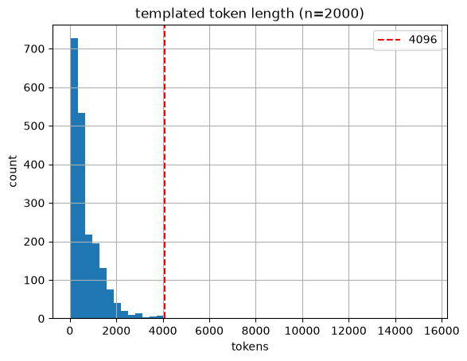

**Turns:** two-turn single exchange dominates (`n_turns=2` on 896,090 rows; multi-turn ~4.9% overall, tail up to 22 turns). `frac_last_assistant=1.0`; system role almost never used; consecutive double-user turns: **0** (the renderer's double-role check will still assert, but risk is ~nil). The packer should treat messages as user/assistant alternation from an empty system.

**Filters Before Sampling:**

1. **716 empty-assistant rows** — all inside `tulu_v3.9_synthetic_finalresp_wildguardmixtrain_decontaminated_50k` (1.43% of that source). Drop unconditionally.
2. **weak assistant** (`assistant_chars < 50`) — **80,875 rows (8.6%)**, concentrated in `flan_v2_converted` (34,889), `aya_100k` (29,962), `wildchat` (4,214), `wildjailbreak` (4,000). By family: general_ift 44,771 / multilingual 29,962 / safety 4,081 / preference_ish 2,061; **math + code have zero weak rows**. Keeping them adds mostly empty multilingual/flan replies to the 25k; confirm drop-vs-keep when building the subset (recommend drop — free quality with negligible math/code cost).
3. **length tail** `>4096` — truncate (prompt-mask keeps loss on prompt turns only) or filter; ~1.15% of rows.

**Sample Renders** (cell 16 / cell 5): template spot-check on 5 sources confirms `apply_chat_template` renders each role once, cleanly — Terraform/ASG-style code, math, and jailbreak-adjacent samples all render without double markers.

**Prep Actions:** empty-assistant drop → (decide) weak-assistant drop → 8-gram decontam → **source-family-stratified 25k with math+code oversampling** → truncate/filter `>4096`.

---

#### 2. UltraFeedback → RM / DPO / PPO

Dataset: [`HuggingFaceH4/ultrafeedback_binarized`](https://huggingface.co/datasets/HuggingFaceH4/ultrafeedback_binarized).

**Splits:**

| split | n | use |
|---|---|---|
| `train_prefs` | 61,135 | RM 20k + DPO 10k (disjoint by `prompt_id`) |
| `test_prefs` | 2,000 | PPO 1.5k prompts only |

Budget fits with slack: 20k+10k ≤ 61,135 (RM then DPO, no overlap); 1.5k ≤ 2k (PPO). The dataset's own train/test split therefore already keeps preference-pair training data separate from the PPO prompt pool — **no cross-train leakage by construction** (verified: `prompt_id` spaces are disjoint).

**Schema:** `{prompt, prompt_id, chosen, rejected, messages, score_chosen, score_rejected}`; chosen/rejected are chat message lists — all length/scores below use the **last assistant turn**.

**Summary (`train_prefs`):** `prompt_chars` mean 660 / p50 356 / max 14,512; `chosen_chars` mean 1,295 / p50 981 / max 12,603; `rejected_chars` mean 1,121 / p50 797 / max 8,261. Chosen is systematically longer than rejected (p50 981 vs 797) — the well-known UltraFeedback **chattiness confound**: a reward model trained on raw scores will learn "longer = better". Keep this in mind for O3/PPO diagnosis (the length-controlled win-rate exists precisely for this). Every pair has exactly 2 turns (`chosen_n_turns=rejected_n_turns=2.0`, std 0) — no multi-turn prefs.

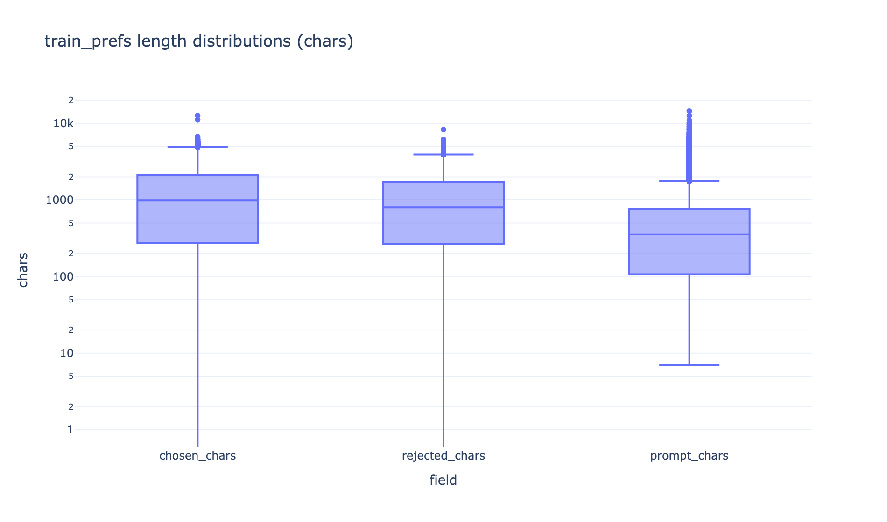

**Scores (`train_prefs`):** accept ≈ 7.83 ± 1.13, reject ≈ 5.95 ± 1.99, **margin ≈ 1.87 ± 1.75** (min 0.0, max 8.5). Distribution is dense at the top (chosen mode 8.0–8.5) and skewed; rejected is wide. Test_prefs is the same profile (7.85 / 6.03 / 1.82) — no split drift.

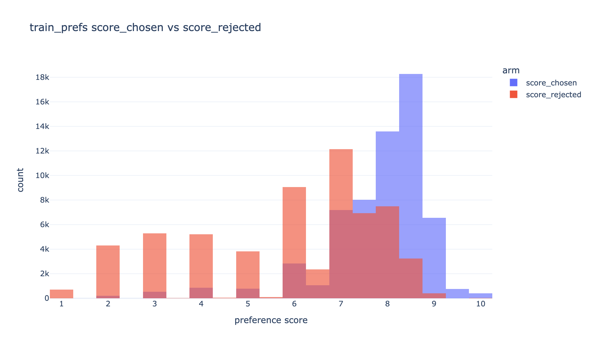
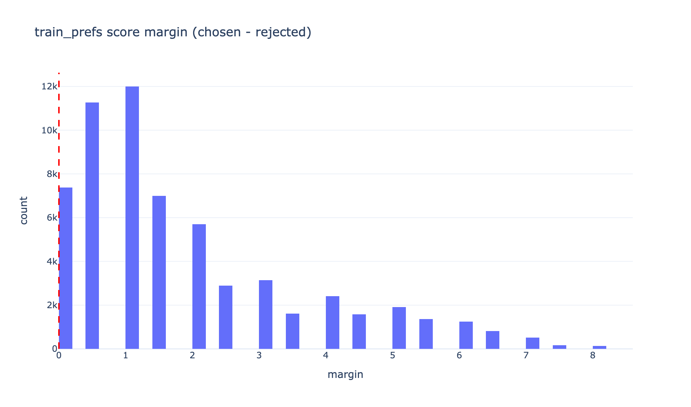

**Margin Caveat for DPO:** `score_margin` reaches a floor of **0.0** (ties / weak pairs) — a substantial low-margin mass sits under 0.5–1.0. For 20k RM those pairs are still usable (BT handles small margins), but for the 10k DPO set they are weak signal; consider a `margin > 0` (or `> 0.5`) filter when building the DPO split. Also note **margin correlates with chosen-vs-rejected length delta** (scatter in notebook; see figure below) — the pairs that "look clearest" to the annotators are largely the longer-vs-shorter pairs, which is the same chattiness confound as above and the reason the DPO-vs-PPO verdict needs length control (reported raw *and* length-controlled).

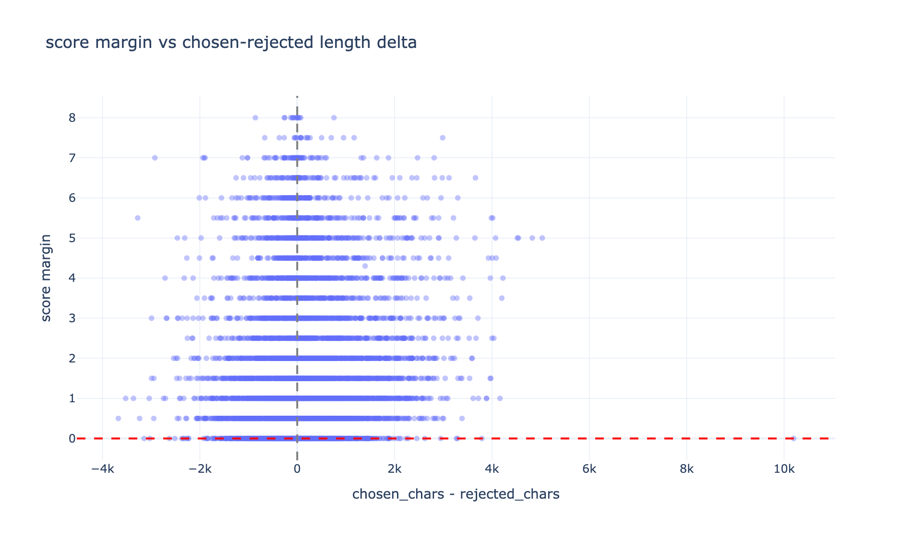

**`prompt_id` Uniqueness:** 61,124 unique ids on 61,135 rows (11 duplicated prompt ids, max 2 rows per id — the notebook's "rows per prompt_id" chart shows the single small dup group). Sampling RM then DPO by *unique* `prompt_id` and asserting an empty intersection (the id-level assert the DPO builder performs) is straightforward.

**Filters:**

- drop empty chosen/rejected sides before sampling (2 rows flagged each in train_prefs): keep the drop consistent with the Tulu empty-assistant drop semantics.
- pairs with `score_margin ≤ 0`: weak BT/DPO signal — policy decision documented above.

**PPO Prompts:** draw **1,500 of the 2,000 `test_prefs`** prompts (prompt text only, labels ignored at train time). `test_prefs` length/scores match train (see comparison charts) — the 1.5k pool is representative of the preference domain, which is exactly what PPO should be judged on.

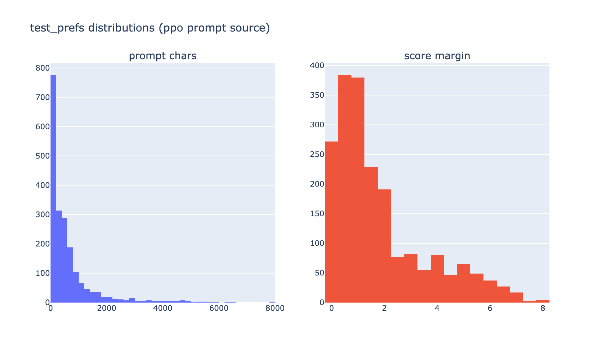

**Prep Actions:** id-disjoint RM 20k / DPO 10k from `train_prefs` (per unique `prompt_id`), optional margin filter on DPO; PPO 1.5k prompts from `test_prefs`.

---

#### 3. Eval Sets → Decontam + Gate Design

Datasets: [`allenai/reward-bench`](https://huggingface.co/datasets/allenai/reward-bench) · [`tatsu-lab/alpaca_eval`](https://huggingface.co/datasets/tatsu-lab/alpaca_eval) · [`google/IFEval`](https://huggingface.co/datasets/google/IFEval) · [`cais/mmlu`](https://huggingface.co/datasets/cais/mmlu).

Analyze **per `split_id`** — never merge MMLU splits (or RB raw/filtered) for stats or conclusions.

**Roles / Sizes / Decontam Fields:**

| split_id | n | role | decontam field |
|---|---|---|---|
| `reward_bench_filtered` | 2,985 | RM gate (prefer over `raw`) | `prompt` |
| `reward_bench_raw` | 5,123 | diagnostic only | `prompt` |
| `alpaca_eval_eval` | 805 | judged head-to-head prompts | `instruction` |
| `ifeval_train` | 541 | IF / format guardrail | `prompt` |
| `mmlu_test` | 14,042 | skills / broken-run | `question` |
| `mmlu_validation` | 1,531 | skills | `question` |
| `mmlu_dev` | 285 | skills | `question` |
| `mmlu_auxiliary_train` | 99,842 | **exclude** from default bank | — |

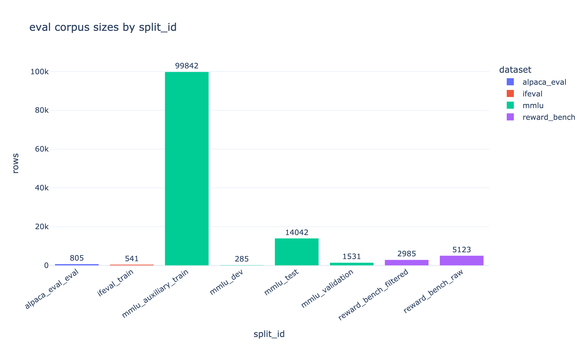

**Lengths (chars, per `split_id`):**

| split_id | n | p50 | p90 | max |
|---|---|---|---|---|
| alpaca_eval_eval | 805 | 100 | 320 | 1,917 |
| ifeval_train | 541 | 191 | 329 | 1,858 |
| mmlu_test | 14,042 | 117 | 759 | 4,671 |
| mmlu_validation | 1,531 | 121 | 752 | 3,511 |
| mmlu_dev | 285 | 112 | 460 | 2,052 |
| reward_bench_filtered | 2,985 | 145 | 540 | 3,565 |
| reward_bench_raw | 5,123 | 115 | 469 | 3,565 |

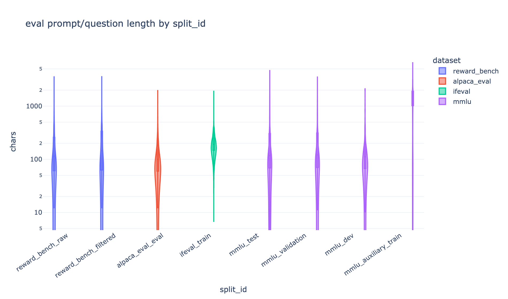

**Qwen token lengths (sample, up to 400/split):** means are small (alpaca 36, IFEval 47, RB-filtered 63, mmlu_test 57) but tails exist (p99 248–422; max 607 in mmlu_test). No eval prompt comes close to the 4,096 train budget, so eval-time context is not a design constraint; the long prompts that matter for decontam are the **mmlu_auxiliary_train** rows (p50 1,565 chars — 100k rows of near-duplicate stem text; see 8-gram numbers below).

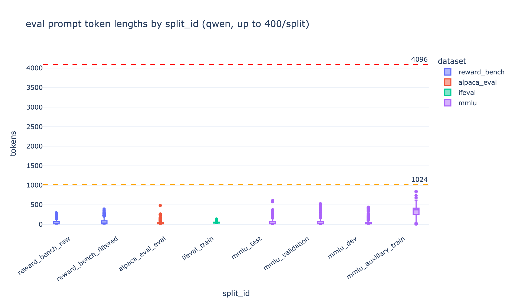

**RewardBench:** gate on **chat** subsets (≥65–70% pass). Subset mix per split:

- `raw` (5,123): chat 2,415 (alpacaeval-easy 805 / hard 805 / length 805) / reasoning 1,346 / safety 740; plus llmbar + hep etc.
- `filtered` (2,985): chat **290** (easy 100 / hard 95 / length 95) / reasoning 1,552 (math-prm 447 dominates) / safety 1,143.

So the *filtered* split keeps only 290 chat rows (reward-bench's own contamination filter trimmed chat hardest); the raw split's 2,415 chat rows are the larger, noisier pool. **Gate decision:** score the raw `chat` subsets (the ~2.4k easy/hard/length pool, mirroring the "≥65–70% RewardBench-chat" bar), with filtered as a diagnostic — or run both and report. Scoring is `prompt+chosen` vs `prompt+rejected` at eval time (RB has no score column).

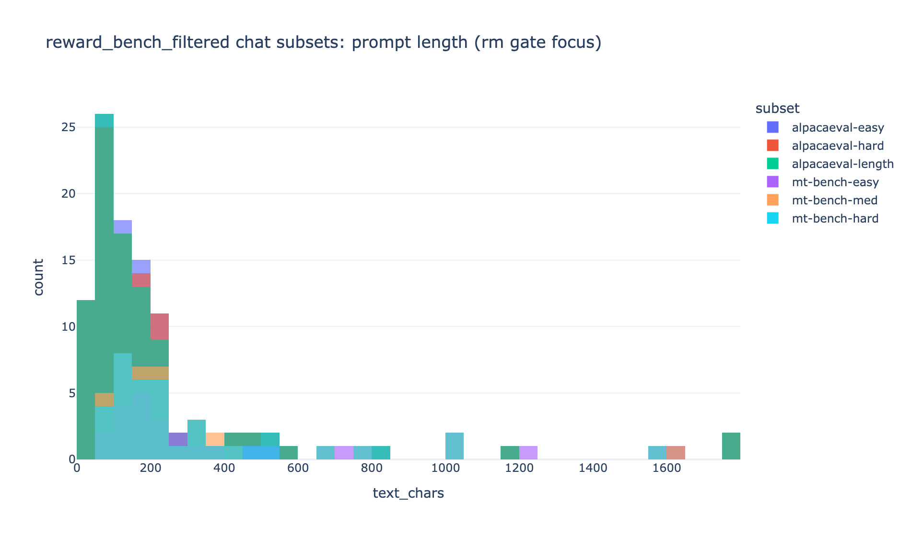

**Internal Duplication (normalized prompt text):**

| split_id | rows | unique_norm | frac_rows_duplicated |
|---|---|---|---|
| reward_bench_raw | 5,123 | 3,438 | **0.495** |
| reward_bench_filtered | 2,985 | 2,733 | **0.131** |
| alpaca_eval_eval | 805 | 805 | 0.000 |
| ifeval_train | 541 | 541 | 0.000 |
| mmlu_test | 14,042 | 13,866 | 0.024 |
| mmlu_validation | 1,531 | 1,528 | 0.004 |
| mmlu_dev | 285 | 284 | 0.007 |
| mmlu_auxiliary_train | 99,842 | 98,478 | 0.027 |

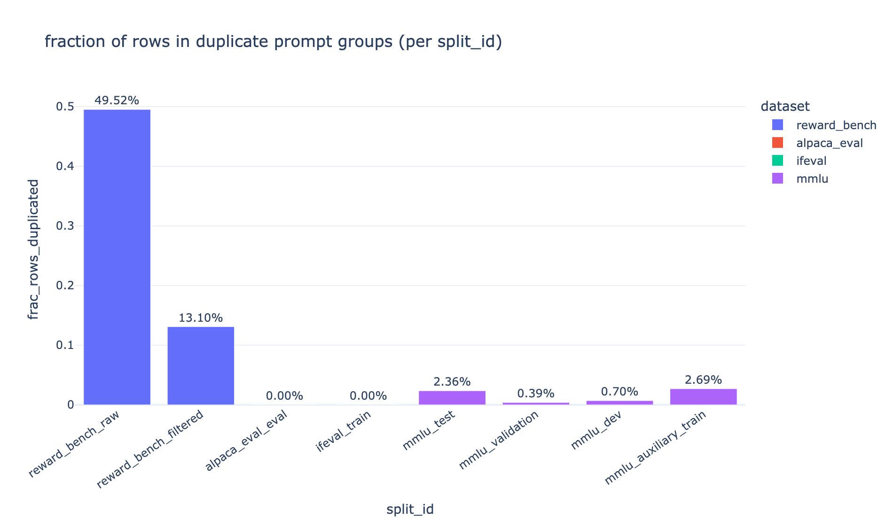

RB "dups" are intentional — the same prompt re-appears with *different* chosen/rejected pairs across `alpacaeval-*` / `mt-bench-*` style subsets (e.g. 852 dup groups = 2,537 rows in raw). **Do not collapse before scoring.** Exact triple copies ≈ 0; mmlu duplication is the known dev/val/aug/aux stem overlap, not a bug.

**Cross-Split Exact Overlap (normalized):**

| a | b | overlap | frac_of_a | frac_of_b |
|---|---|---|---|---|
| reward_bench_raw | reward_bench_filtered | 2,733 | 0.795 | 1.000 |
| reward_bench_raw | alpaca_eval_eval | 805 | 0.234 | 1.000 |
| reward_bench_filtered | alpaca_eval_eval | 102 | 0.037 | **0.127** |
| mmlu_test | mmlu_validation | 38 | 0.003 | 0.025 |
| mmlu_test | mmlu_dev | 5 | ~0 | 0.018 |
| mmlu_* ↔ ifeval_train | — | **0** | — | — |
| alpaca_eval ↔ ifeval / mmlu | — | **0** | — | — |

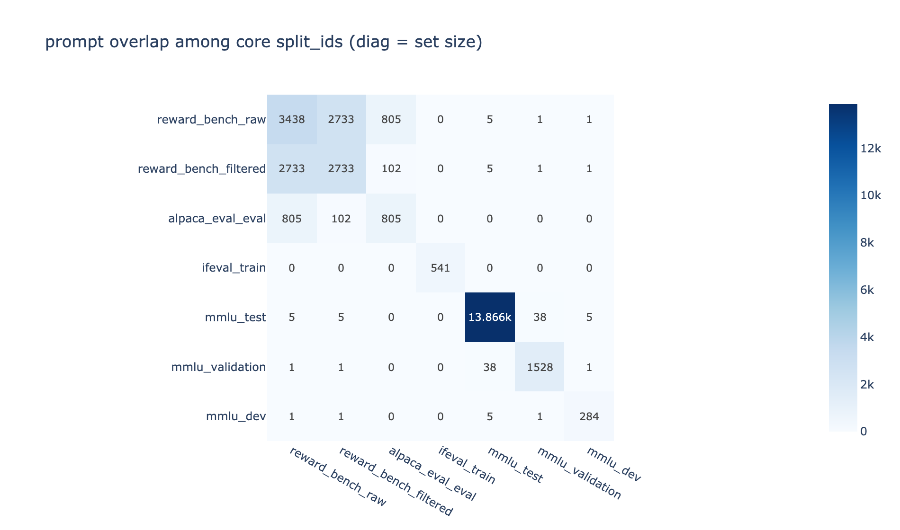

The 102 RB-filtered ∩ alpaca_eval prompts are expected (RB's alpacaeval subsets). IFEval is fully isolated (0 overlap with everything) — a clean format guardrail. MMLU↔RB overlap ≈ 0. So the decontam bank barely self-overlaps, which means: **an 8-gram bank built from all core split_ids is near-minimal and each eval family adds distinct coverage** — no double counting when computing hit rates.

**8-Gram Bank (whitespace 8-grams on decontam fields; sliding windows counted with multiplicity):**

| split_id | texts_scanned | ngram_instances | unique_8grams |
|---|---|---|---|
| reward_bench_raw | 5,123 | 143,445 | 64,202 |
| reward_bench_filtered | 2,985 | 98,839 | 50,162 |
| alpaca_eval_eval | 805 | 17,470 | 16,966 |
| ifeval_train | 541 | 16,268 | 15,473 |
| mmlu_test | 14,042 | 558,939 | 434,406 |
| mmlu_validation | 1,531 | 61,253 | 56,339 |
| mmlu_dev | 285 | 9,264 | 9,101 |
| mmlu_auxiliary_train (sample 5k) | 5,000 | 1,243,733 | 1,155,095 |

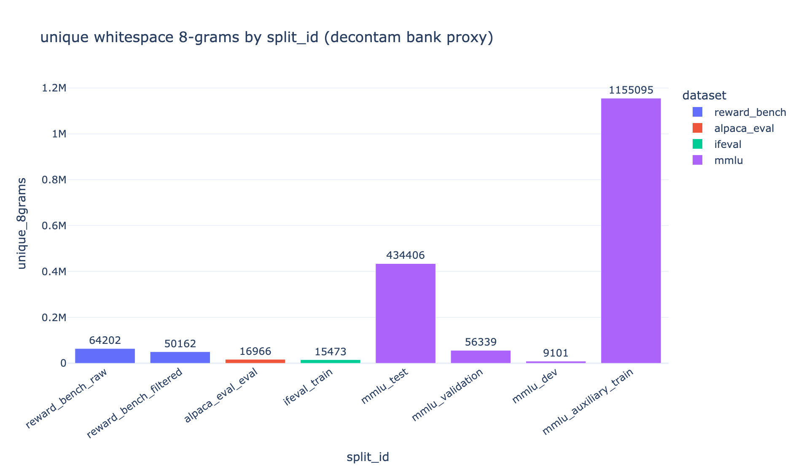

`mmlu_auxiliary_train` alone would add ~1.15M unique 8-grams (10× the whole rest of the bank) — mostly boilerplate stems ("A: \nB: \nC: \nD: ..." templates around near-duplicate content). **Exclude it from the default bank** (it decontaminates the *format*, not the content, and bloats the bank 10× for ~zero marginal coverage on real splits); the MMLU drop-flag (>5 pts) is the practical guardrail against aux leakage instead.

**AlpacaEval** (805): columns `instruction`, `output`, `generator`, `dataset`; **`output` is the `text_davinci_003` reference, not a gold label**; only `instruction` is the eval prompt; `dataset` gives the useful helpful_base split (top source; see notebook chart). head-to-head = our models + **JudgeArena** (AlpacaEval task, local `VLLM/Qwen/Qwen2.5-32B-Instruct` judge, length-controlled win-rate) — not the `alpaca-eval` package (pinned deps rule).

**IFEval** (541): `{key, prompt, instruction_id_list, kwargs}`; **25 verifiers across 9 categories** (keywords 163 mentions, detectable_format 157, length_constraints 143, change_case 89, startend 67, punctuation 66, combination 65, detectable_content 53, language 31 — per prompt, not rows; each prompt can stack verifiers). Non-null `kwargs[i]` = args for verifier `i` (e.g. `number_placeholders` → `num_placeholders`; `keywords:existence` → `keywords`); ~half the verifiers take no args ("checker needs no args"). A few prompts carry 2–3 stacked verifiers (see notebook stacked chart). **Do not reimplement verification** — use `lm-eval` task `ifeval` (`lm_eval.tasks.ifeval`).

**MMLU:** `{question, subject, choices, answer}` — MCQ, gold is A–D index (`ClassLabel`), answer indices near-uniform per split (e.g. test: 3,222 / 3,462 / 3,582 / 3,776). Subjects per split: test has all 57 (professional_law leads 1,534; elementary_mathematics 378); validation subset mirrors roughly; dev = 5 questions per subject with uniform 5/subject structure (top-subject charts in notebook); auxiliary_train has no subject column — another reason to keep it out of the generic path. **Evaluate via lm-eval `mmlu`; report per-split.**

---

#### 4. Checklist (from EDA)

1. SFT: drop empty assistants → optional weak-assistant drop (recommend drop; 8.6%, zero math/code cost) → 8-gram decontam (bank = all split_ids **except** mmlu_auxiliary_train) → **source-family-stratified 25k with math+code oversampled** → truncate/filter `>4096` (~1.15%).
2. RM 20k + DPO 10k: disjoint unique `prompt_id`s from `train_prefs` (11 duplicated ids handled at id level); drop empty sides; consider `margin > 0` filter on DPO only.
3. PPO 1.5k: prompts from `test_prefs` only (already disjoint from train_prefs by construction).
4. Decontam bank: RB filtered + alpaca instructions + IFEval prompts + MMLU test/val/dev questions (not auxiliary_train).
5. Eval wiring later: RewardBench-chat gate on raw chat pool (2.4k) with filtered as diagnostic; IFEval via lm-eval; MMLU via lm-eval; alpaca instructions for JudgeArena judged head-to-head.